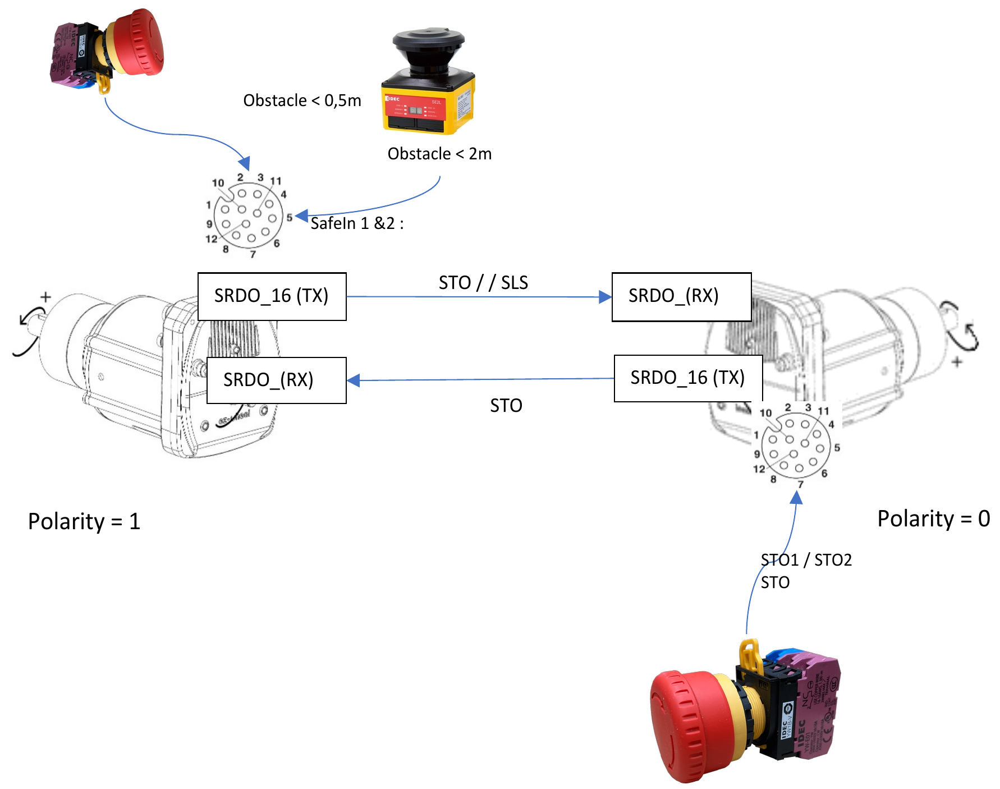
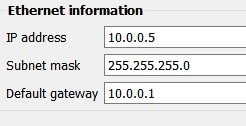
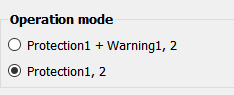
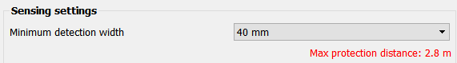
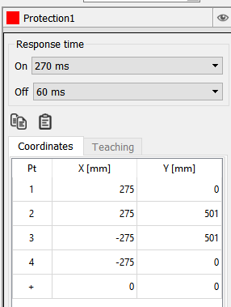
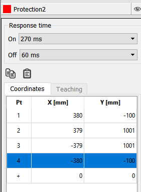
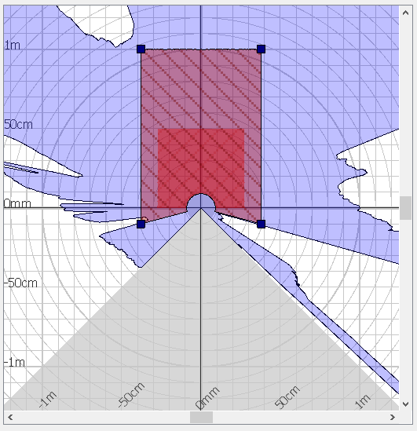

# Commissioning
## Safety connections
In the SWD Starter Kit, the Left SWD Core motor is connected to the SE2L safety LiDAR, and both the left and right motors are connected to two emergency stop buttons.
The motors then communicates the safety information with each other via the CANOpen Safety protocol.

The overall connections are as follow:

## Right motor

On this motor, we connected:

- The right emergency stop button to activate `STO1` and `STO2`, (`OSSD1` and
  `OSSD2`).
 
The security inputs are received on `SRDO1 (RX)`. The security functions (`STO`,
`SDI` and `SLS`) are sent by the left motor.

The left motor receive the `STO` of the right motor to provide the `STO`
security function.

| **Parameter**                   | **Value**                                     |
|---------------------------------|-----------------------------------------------|
| NodeId                          | `0x5`                                         |
| Polarity                        | `0` (clockwise)                               |
| SRDO 9                          | Active on RX (default configuration)          |
| SRDO 9 Communication            | Direction = `2`, Cob-Id = `0x160, 0x161`      |
| SRDO 1: SCW `CAN2` Mapping      | `Bit 0: STO`                                  |
|                                 | `Bit 1: STO`                                  |
|                                 | `Bit 2: SDIp`                                 |
|                                 | `Bit 3: SDIp`                                 |
|                                 | `Bit 4: SLS_1`                                |
|                                 | `Bit 5: SLS_1`                                |
| SRDO 16                         | Active on TX                                  |
| SRDO 16 Communication           | Direction = `1`, Cob-Id = `0x109, 0x10A`      |
| SRDO 16: SCW `SAFEIN_1` Mapping | `Bit 0: STO`                                  |
|                                 | `Bit 1: STO`                                  |
| Velocity slopes                 | `vl_velocity_deceleration_delta_speed : 1000` |
| STO parameters                  | `restart_acknowledge_behavior : false`        |
| SLS parameters                  | `velocity_limit_u32 : 680`                    |
|                                 | `time_to_velocity_monitoring : 1000`          |

See the commissioning script [`commissioning/swd_right_5_commissioning.py`](https://github.com/ezWheelSAS/swd_starter_kit_scripts/blob/main/commissioning/swd_right_5_commissioning.py).

## Left motor

On this motor, we connected:

- The connector of the SE2L LiDAR for safety zones information: `SDI` is
  connected on `SafeIn 1 & 2`, and `SLS` is connected on `SafeOut 1 & 2`.
- The left emergency stop button to activate `STO1` and `STO2`, (`OSSD1` and
  `OSSD2`).

The security inputs are sent to the right motor via `SRDO 16 (TX)` to propagate
the security functions (`SDI` and `SLS`) states and the state of the emergency
stop (`STO`). 

| **Parameter**                   | **Value**                                     |
|---------------------------------|-----------------------------------------------|
| NodeId                          | `0x4`                                         |
| Polarity                        | `1` (anti-clockwise)                          |
| SRDO 9                          | Active on RX (default configuration)          |
| SRDO 9 Communication            | Direction = `2`, Cob-Id = `0x109, 0x10A`      |
| SRDO 9: SCW `CAN2` Mapping      | `Bit 0: STO`                                  |
|                                 | `Bit 1: STO`                                  |
| SRDO 16                         | Active on TX                                  |
| SRDO 16 Communication           | Direction = `1`, Cob-Id = `0x160, 0x161`      |
| SRDO 16: SCW `SAFEIN_1` Mapping | `Bit 0: STO`                                  |
|                                 | `Bit 1: STO`                                  |
|                                 | `Bit 2: SDIn`                                 |
|                                 | `Bit 3: SDIn`                                 |
|                                 | `Bit 4: SLS_1`                                |
|                                 | `Bit 5: SLS_1`                                |
| Velocity slopes                 | `vl_velocity_deceleration_delta_speed : 1000` |
| STO parameters                  | `restart_acknowledge_behavior : false`        |
| SLS parameters                  | `velocity_limit_u32 : 680`                    |
|                                 | `time_to_velocity_monitoring : 1000`          |

See the commissioning script [`commissioning/swd_left_4_commissioning.py`](https://github.com/ezWheelSAS/swd_starter_kit_scripts/blob/main/commissioning/swd_left_4_commissioning.py).

## The SE2L LiDAR
The LiDAR can be commissioned using the constructor's software [SLS Project Designer](https://us.idec.com/idec-us/en/USD/Software-SLS-Project-Designer).

The LiDAR delivered with the SWD Starter Kit comes preconfigured, the project file is available on [`commissioning/StarterKit_IDEC.hucx`](https://github.com/ezWheelSAS/swd_starter_kit_scripts/blob/main/commissioning/StarterKit_IDEC.hucx).

If you need to modify or change the LiDAR zones, make sure the configuration is set correctly.

### Network configuration

### Operation mode

### Sensing settings

### Protection zones (1 & 2)
Activation signal **"Protection1"** on **OSSD 1 & 2** is used for indicating the forward Safe Direction Indication (SDI+), which gets activated if an obstacle is detected at less than **0.5m** (connected to **SafeIn 1 & 2** on the left SWD motor).

Activation signal **"Protection2"** on **OSSD 3 & 4** is used for indicating the Safety Limited Speed (SLS), which gets activated if an obstacle is detected at less than **2m** (connected to **SafeOut 1 & 2** on the left SWD motor).

The configured SLS and SDI zones corresponds to the following geometry:

